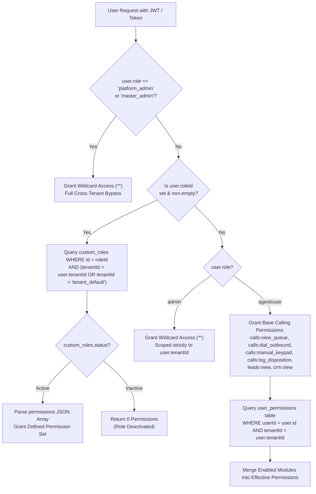
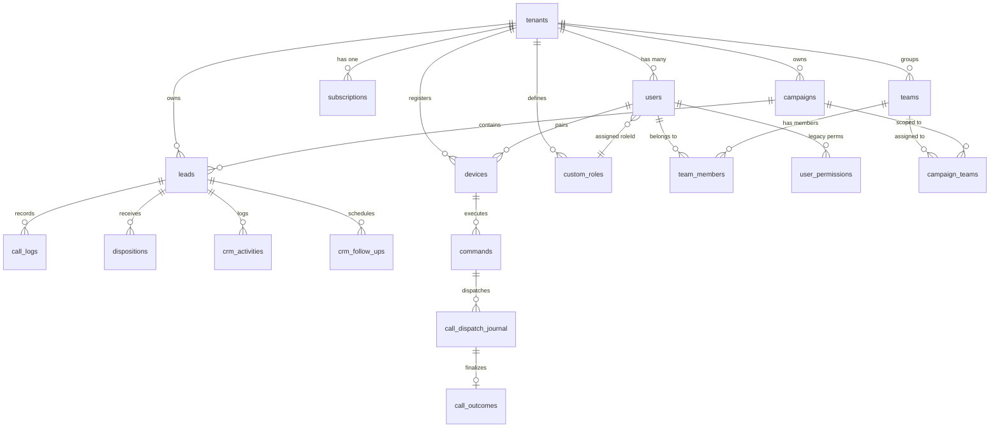

# OCTAL DIALER — CURRENT ARCHITECTURE FORENSIC AUDIT
**Document Version:** 1.0.0 (Authoritative Forensic Report)  
**Date of Audit:** September 21, 2026  
**Audit Scope:** Full Codebase, PostgreSQL Schema, Migrations, Backend API & Sockets, Frontend UI Components, and Live Production Configuration  
**Audit Mode:** READ-ONLY (Zero mutations, zero migrations, zero process restarts, zero secrets exposed)

---

## A. EXECUTIVE SUMMARY

This forensic audit evaluates the actual, authoritative state of the Octal Dialer codebase (`website_octal_dialer` backend & frontend, `application_octal_dialer` Flutter Android client, and production deployment). This assessment was performed by inspecting real TypeScript/React/Dart source files, SQL migrations, database definitions, and server routes, discarding outdated documentation.

### Core Discoveries:
1. **Multi-Tenancy Foundation:** The system is built around a single-tenant-per-user model (`users.tenantId`). A user account belongs strictly to one tenant organization. Cross-tenant data isolation is enforced at the query level in backend services via parameterized SQL `WHERE "tenantId" = $X`.
2. **Dual RBAC Architecture:** Two distinct authorization systems currently coexist:
   - **System A (Authoritative/Modern):** Dynamic JSON-based permissions in `custom_roles` assigned via `users.roleId`.
   - **System B (Legacy Fallback):** Coarse boolean module toggles in `user_permissions`.
   The effective permissions engine in `src/authManager.ts` merges these two systems with hardcoded wildcard fallbacks for unassigned tenant admins (`role === 'admin'`) and platform owners (`role === 'platform_admin'`).
3. **Hardcoded Super Admin Protection:** The platform owner username `mohsin1` and the role `platform_admin` are explicitly protected against demotion in `src/authManager.ts` (line 1011).
4. **Team System vs. UI Disconnect:** The database schema (`teams`, `team_members`, `campaign_teams`) and backend endpoints (`/api/admin/teams`) support hierarchical team grouping and campaign assignment scoping (`getUserScopedCampaignIds`). However, the customer UI has not exposed teams in its main navigation.
5. **Runtime Settings vs. UI Placeholders:** Settings configured in `AdminSystemSettings.tsx` (such as `ringTimeoutSecs`, `dialDelaySecs`, `maxConcurrentDials`, `enforceStrictDnc`) persist into the `system_settings` table but are largely ignored by the real-time telephony state machines in `sessionManager.ts` and `server.ts`, which use fixed code defaults.
6. **Protected Telephony Pipeline:** The telephony dispatch mechanism (`React UI` -> `Socket.IO` -> `Node.js Backend` -> `Socket.IO` -> `Flutter Client` -> `MethodChannel` -> `Android Telecom` -> `Cellular SIM`) is stable and functional.

---

## B. CURRENT ARCHITECTURE DIAGRAM

```text
┌────────────────────────────────────────────────────────────────────────────────────────────────┐
│                                   ZESTIFY / OCTAL DIALER WEB CLIENT                            │
│                             (React 18 / TypeScript / Vite / TailwindCSS)                       │
│                                                                                                │
│  ┌───────────────────────┐   ┌───────────────────────┐   ┌──────────────────────────────────┐  │
│  │   Customer Dialer     │   │     CRM & Campaigns   │   │  Platform / Tenant Admin Console │  │
│  │ (LeadQueue/Keypad/CRM)│   │(Leads/Followups/Logs) │   │ (AdminPanel / AdminUsers / etc.) │  │
│  └───────────┬───────────┘   └───────────┬───────────┘   └─────────────────┬────────────────┘  │
└──────────────┼───────────────────────────┼─────────────────────────────────┼───────────────────┘
               │ Socket.IO                 │ HTTPS (Bearer JWT/Hex Token)    │ HTTPS (Bearer JWT)
               ▼                           ▼                                 ▼
┌────────────────────────────────────────────────────────────────────────────────────────────────┐
│                                      OCTAL BACKEND SERVER                                      │
│                               (Node.js / Express / Socket.IO Engine)                           │
│                                                                                                │
│  ┌────────────────────────┐  ┌────────────────────────┐  ┌──────────────────────────────────┐  │
│  │  authManager.ts        │  │  entitlementManager.ts │  │  sessionManager.ts               │  │
│  │  - validateToken       │  │  - checkEntitlements   │  │  - phone pairing & socket state  │  │
│  │  - getEffectivePerms   │  │  - checkTenantLimit    │  │  - command idempotency & ack     │  │
│  │  - requirePermission   │  │  - plan feature gates  │  │  - binding generation locks      │  │
│  └───────────┬────────────┘  └───────────┬────────────┘  └─────────────────┬────────────────┘  │
│              │                           │                                 │                   │
│  ┌───────────┴───────────────────────────┴─────────────────────────────────┴────────────────┐  │
│  │                      databaseManager.ts (PostgreSQL Connection Pool)                     │  │
│  └───────────────────────────────────────┬──────────────────────────────────────────────────┘  │
└──────────────────────────────────────────┼─────────────────────────────────────────────────────┘
                                           │
          ┌────────────────────────────────┴────────────────────────────────┐
          ▼                                                                 ▼
┌──────────────────────────────────────────┐   ┌─────────────────────────────────────────────────┐
│     POSTGRESQL DATABASE (34 TABLES)      │   │             ANDROID COMPANION CLIENT            │
│  - tenants, users, custom_roles          │   │               (Flutter / Dart App)              │
│  - leads, campaigns, crm_*               │   │                                                 │
│  - call_dispatch_journal, call_outcomes  │   │  Socket.IO Listener (ws:// or wss://)           │
│  - teams, team_members, campaign_teams   │   │                   │                             │
│  - plans, subscriptions, plan_features   │   │  MethodChannel ('com.octal.dialer/telephony')   │
│  - devices, commands, pairing_sessions   │   │                   ▼                             │
│  - system_settings, audit_logs           │   │  Android Native Telephony Framework             │
└──────────────────────────────────────────┘   │                   ▼                             │
                                               │  Dual-SIM Cellular Hardware / Radio Interface   │
                                               └─────────────────────────────────────────────────┘
```

---

## C. USER MODEL

### 1. Database Schema (`users` table in `schema.sql`)
| Column | Type | Constraints / Defaults | Description |
|---|---|---|---|
| `id` | `TEXT` | `PRIMARY KEY` | Unique user identifier (`usr_...` or UUID) |
| `username` | `TEXT` | `NOT NULL` | Unique login username |
| `passwordHash` | `TEXT` | `NOT NULL` | Scrypt salted password hash (timing-safe verification) |
| `role` | `TEXT` | `NOT NULL DEFAULT 'agent'` | Primary role identifier (`platform_admin`, `admin`, `user`) |
| `tenantId` | `TEXT` | Foreign key to `tenants(id)` | Tenant workspace scope (Single-tenant membership) |
| `email` | `TEXT` | Nullable | Contact and notification email address |
| `googleId` | `TEXT` | Nullable | Google OAuth 2.0 unique subject identifier |
| `authProvider` | `TEXT` | `DEFAULT 'local'` | `'local'` or `'google'` |
| `resetToken` | `TEXT` | Nullable | Password reset token |
| `resetTokenExpires`| `TEXT` | Nullable | Expiry timestamp for reset token |
| `displayName` | `TEXT` | Nullable | Human-friendly user name for display in UI |
| `phone` | `TEXT` | Nullable | Contact phone number |
| `status` | `TEXT` | `NOT NULL DEFAULT 'Active'` | Account status: `'Active'`, `'Inactive'`, `'suspended'` |
| `ipRestrictions` | `TEXT` | Nullable | Comma-separated IP whitelist for agent login |
| `avatar_url` | `TEXT` | Nullable | Profile avatar URL |
| `roleId` | `TEXT` | Foreign key to `custom_roles(id)` | Link to custom dynamic RBAC profile |
| `createdAt` | `TEXT` | `NOT NULL DEFAULT ''` | ISO creation timestamp |
| `updatedAt` | `TEXT` | Nullable | ISO last update timestamp |
| `emailVerified` | `INTEGER` | `DEFAULT 0` | Boolean flag (1=verified, 0=unverified) |
| `emailVerifiedAt` | `TEXT` | Nullable | Timestamp of verification |
| `needsProfileSetup`| `INTEGER` | `DEFAULT 0` | Flag prompting initial profile completion |

### 2. User Authentication & Identity
- **Local Credentials:** Verified using `crypto.scryptSync` with a 16-byte random salt and `timingSafeEqual`.
- **Google OAuth:** Implemented in `authManager.ts` (`loginWithGoogle`, `registerGoogleSignUp`). Reconciles via `googleId` or matching email address.
- **Session Tokens:** Emits signed JWTs containing `{ sub: user.id, username, role, tenantId, email }` with a 24-hour expiration window.
- **Legacy Tokens:** Validates 64-character random hex tokens stored in `sessions_store` to guarantee backwards compatibility.

---

## D. ROLE MATRIX

| Role Identifier | Where Created | Where Normalized | Where Stored | Where Checked | Actual Authority Granted | Type |
|---|---|---|---|---|---|---|
| `platform_admin` | Seed script / Master Setup | None (Canonical) | `users.role` | `requirePlatformAdmin`, `getEffectivePermissions`, `server.ts` | Complete system-wide authority (`*`). Cross-tenant visibility, tenant suspension, tenant impersonation, global plan management. | **Active (SaaS Owner)** |
| `master_admin` | Historical setups / configs | `authManager.ts:1007` | Not stored (Legacy) | `authManager.ts:998`, `authManager.ts:1096` | Treated identically to `platform_admin`. Bypasses tenant scoping. | **Alias / Legacy** |
| `admin` | Tenant creation (`initiateEmailSignup`, `signupTenant`) | None (Canonical) | `users.role` | `App.tsx`, `authManager.ts`, `server.ts` | Workspace/Tenant Administrator. If `roleId` is null, gains full wildcard `*` access strictly inside own `tenantId`. Cannot see other tenants. | **Active (Tenant Admin)** |
| `agent` | UI role selectors (`AdminUsers.tsx`) | `authManager.ts:1021` (`newRole === 'agent' ? 'user' : newRole`) | Displayed as `agent`; stored as `user` | `App.tsx:70` | Standard calling agent. Can view assigned queues, initiate phone calls, save dispositions, view assigned CRM records. | **Active (UI Alias)** |
| `user` | Database default (`schema.sql:49`) | Normalized from `agent` | `users.role` | `authManager.ts:1090`, `authManager.ts:1145` | Canonical database value representing an agent/seat in an organization. | **Active (DB Stored)** |
| `superadmin` / `tenant_admin` / `supervisor` | Not defined in code | N/A | None | None | No system logic references these strings. Replaced by `platform_admin` and `admin`. | **Deprecated / Inactive** |

---

## E. EFFECTIVE PERMISSION RESOLUTION FLOW

The authorization logic is implemented in `getEffectivePermissions(user: AuthUser)` in `src/authManager.ts`:



### Coexisting Permission Mechanisms:
| Permission Mechanism | Storage Location | Scope | Used By | Evaluation Priority | Legacy Status |
|---|---|---|---|---|---|
| **Super Admin Wildcard** | Code (`authManager.ts:1096`) | Global (Cross-tenant) | SaaS Owner (`platform_admin`) | **Priority 1 (Highest)** | Active |
| **Custom Dynamic Roles** | `custom_roles` table | Tenant / Workspace | Users with assigned `roleId` | **Priority 2** | Active (Modern RBAC) |
| **Admin Lockout Prevention** | Code (`authManager.ts:1139`) | Tenant Workspace | Tenant Admin without `roleId` | **Priority 3** | Active (Safety Fallback) |
| **Default Agent Matrix** | Code (`authManager.ts:1146`) | Tenant Workspace | Unassigned Agents (`role='user'`) | **Priority 4** | Active |
| **Legacy User Permissions** | `user_permissions` table | Tenant Workspace | Unassigned Agents (`role='user'`) | **Priority 5 (Merged)** | **Legacy (To Deprecate)** |

---

## F. TENANT / BUSINESS MODEL

### 1. Architectural Definition of Tenant
In the current implementation, a **Tenant** corresponds to an isolated commercial customer company or organization:
- Created in the `tenants` table with `id`, `name`, `slug`, `status` (`'active'` | `'suspended'`), `tier`, `maxAgents`, and `leadPoolMode`.
- **Membership Structure:** Strictly **1:N (One tenant has many users)**.
- **Can a user belong to multiple tenants?** **NO.** `users.tenantId` is a single string foreign key. Multi-tenant workspace switching is not supported for regular users.
- **Can a tenant have multiple admins?** **YES.** Multiple users under the same `tenantId` can have `role = 'admin'`.
- **Is there a distinct Tenant Owner?** `tenants.ownerEmail` stores the email of the account creator, but database authorization treats all users with `role = 'admin'` under that `tenantId` identically.
- **Personal vs. Company Accounts:** No distinction exists. Every user account must be associated with a `tenantId`.
- **Tenant Isolation Enforcement:** Strictly enforced server-side. Every data query on business tables includes `WHERE "tenantId" = $1`. The tenant identifier is extracted directly from the verified server-side JWT (`req.user.tenantId`) and never trusted from client payloads.

---

## G. TEAM HIERARCHY AND VISIBILITY MATRIX

### 1. Database Schema (`teams`, `team_members`, `campaign_teams`)
- `teams`: `id`, `name`, `tenantId`, `leaderId`, `createdAt`, `updatedAt`
- `team_members`: `id`, `teamId`, `userId`, `tenantId`, `roleInTeam` (`'leader'` | `'member'`), `joinedAt`
- `campaign_teams`: `id`, `campaignId`, `teamId`, `tenantId`, `assignedAt`

### 2. Forensic Findings on Team Operations
1. **Can a user belong to multiple teams?** **YES.** The `team_members` table does not have a unique constraint on `(userId, tenantId)`. A user can exist in multiple teams.
2. **Can a team have multiple leaders?** **YES.** While `createTeam` sets a primary `leaderId`, multiple rows in `team_members` can hold `roleInTeam = 'leader'`.
3. **Can Team Lead A see Team B?** Backend endpoints (`/api/admin/teams`) require `admin` or `platform_admin`. There are no dedicated "Team Lead" API routes restricting visibility to only the lead's team.
4. **Can agents see each other's leads?** Controlled by `tenants.leadPoolMode`:
   - If `shared`: All agents in the tenant query leads from the shared campaign pool.
   - If `assigned`: Queries filter on `leads.assignedTo = user.id`.
5. **Campaign Scoping by Team:** The function `getUserScopedCampaignIds(userId, tenantId)` in `src/databaseManager.ts:1342` resolves campaigns assigned to the user's teams via `campaign_teams`.
6. **Frontend Exposure Gap:** The frontend navigation bar does not have a dedicated "Teams" tab. Team management is handled via the Users admin panel or direct API invocations.

---

## H. CRM / LEAD OWNERSHIP MODEL

### 1. Lead and Campaign Schema
- `leads`: `id`, `name`, `phone`, `status`, `campaignId`, `tenantId`, `assignedTo`, `createdAt`, `updatedAt`
- `campaigns`: `id`, `name`, `tenantId`, `status`, `totalLeads`, `dialedLeads`, `createdAt`
- `crm_companies`: `id`, `name`, `domain`, `phone`, `tenantId`, `ownerId` (`users.id`)
- `crm_contacts`: `id`, `firstName`, `lastName`, `phone`, `email`, `companyId`, `tenantId`, `ownerId`
- `crm_activities`: `id`, `leadId`, `tenantId`, `userId`, `username`, `eventType`, `description`, `timestamp`
- `crm_follow_ups`: `id`, `leadId`, `tenantId`, `assignedTo`, `dueDate`, `status`, `notes`
- `dispositions`: `id`, `leadId`, `outcome`, `notes`, `loggedAt`, `tenantId`

### 2. Readiness for Future Visibility Concept
| Future Visibility Target | Current Architecture Support | Existing Schema Columns | Required Changes for Redesign |
|---|---|---|---|
| **Member / Agent -> OWN** | **Supported** | `leads.assignedTo`, `crm_follow_ups.assignedTo`, `crm_contacts.ownerId` | Enforce backend query filter `assignedTo = req.user.id` when role is agent. |
| **Team Lead -> TEAM** | **Partially Supported (Backend Only)** | `team_members.teamId`, `campaign_teams.teamId` | Add `teamId` column to `leads` and create Team Lead middleware scoping queries to team member IDs. |
| **Company Owner -> WORKSPACE** | **Fully Supported** | `"tenantId"` across all tables | Existing tenant scoping covers this completely. |
| **Platform Owner -> PLATFORM** | **Fully Supported** | Bypasses `tenantId` in queries | Already implemented via `requirePlatformAdmin`. |

---

## I. BILLING / PRODUCTS / ENTITLEMENT MODEL

### 1. Catalog Plans (`src/entitlementManager.ts`)
| Plan ID | Plan Name | Monthly Price | Yearly Price | Limits (Users / Devices / Campaigns / Leads) | Included Features |
|---|---|---|---|---|---|
| `plan_starter` | Starter Plan | \$29 | \$290 | 5 Users / 3 Devices / 20 Campaigns / 10k Leads | Octal Dialer, Google Scraper, Analytics, API Keys |
| `plan_pro` | Professional Plan | \$79 | \$790 | 20 Users / 10 Devices / 100 Campaigns / 100k Leads | All Starter + Auto Emailer, FB Scraper, FB Poster, Custom Roles |
| `plan_enterprise`| Enterprise Plan | \$199 | \$1990 | 1000 Users / 500 Devices / 10k Campaigns / 10M Leads| All Pro Features Unlocked |
| `plan_legacy` | Legacy Unlimited | \$0 | \$0 | 1000 Users / 500 Devices / 10k Campaigns / 10M Leads| Internal / Early Tenant Default |

### 2. Product Module Matrix
| Module | Access Check Mechanism | Tenant vs User | Seat Allocation | Usage Tracking | Billing Ready? |
|---|---|---|---|---|---|
| **Octal Dialer** | `entitlements.features.octalDialer` + `calls:dial_outbound` | Tenant Entitlement + User Perm | Supported (`maxDevices`, `maxUsers`) | Real-time concurrent calls | **Yes** |
| **CRM Pro** | `userPermissions.crm` / `leads:view` | Tenant Scoped | Based on `maxUsers` | Count of leads in DB | **Yes** |
| **Google Maps Scraper** | `entitlements.features.googleScraper` | Tenant Entitlement | Tenant Shared | `dailyScrapeLimit` (Settings) | **Yes** |
| **Auto Emailer** | `entitlements.features.autoEmailer` | Tenant Entitlement | Tenant Shared | Email dispatch counts | **Yes** (Pro+) |
| **Facebook Scraper** | `entitlements.features.facebookScraper` | Tenant Entitlement | Tenant Shared | Scrape task queue | **Yes** (Pro+) |
| **FB Autoposter** | `entitlements.features.facebookPoster` | Tenant Entitlement | Tenant Shared | Scheduled post count | **Yes** (Pro+) |

---

## J. SETTINGS INVENTORY

### Forensic Analysis of Runtime Impact:
| Setting Key | Visible In UI Component | Stored In | Real Runtime Effect? | Reality / Forensic Finding |
|---|---|---|---|---|
| `ringTimeoutSecs` | `AdminSystemSettings.tsx` | `system_settings` | **NO (UI-Only)** | Dialing engine uses hardcoded timeout constants in `sessionManager.ts`. Setting is never queried during calls. |
| `dialDelaySecs` | `AdminSystemSettings.tsx` | `system_settings` | **NO (UI-Only)** | Delay between numbers is controlled by the frontend auto-dialer timer in `LeadQueue.tsx`. |
| `maxConcurrentDials`| `AdminSystemSettings.tsx` | `system_settings` | **NO (UI-Only)** | Android companion client is limited to 1 call per active SIM slot. Backend does not enforce this setting. |
| `sessionTimeoutMins`| `AdminSystemSettings.tsx` | `system_settings` | **NO (UI-Only)** | JWT expiry is fixed at 24 hours in `authManager.ts`. |
| `enforceStrictDnc` | `AdminSystemSettings.tsx` | `system_settings` | **PARTIAL** | Backend DNC check queries `suppression_list` table directly, not this flag. |
| `autoDropVoicemail`| `AdminSystemSettings.tsx` | `system_settings` | **NO (UI-Only)** | Voicemail detection is not implemented in the Android native telephony layer. |
| `leadPoolMode` | `AdminSystemSettings.tsx` | `tenants.leadPoolMode`| **YES** | Read by lead distribution endpoints to determine assigned vs. shared lead queries. |
| `grace_period_days`| Backend only | `system_settings` | **YES** | Queried by `billingManager.ts` during subscription status checks. |

---

## K. CURRENT PLATFORM ADMIN ARCHITECTURE

### 1. Active vs. Dead Admin Components
```text
frontend/src/components/admin/
├── AdminPanel.tsx                 [ACTIVE - Main Admin Shell]
│   ├── sections/
│   │   ├── AdminDashboard.tsx     [DEAD / UNUSED - Replaced by summary cards in AdminPanel]
│   │   ├── AdminUsers.tsx         [ACTIVE - User CRUD, Role assignment, Dynamic role modals]
│   │   ├── AdminSystemSettings.tsx[ACTIVE - Reads/Writes system_settings and tenant parameters]
│   │   ├── AdminAuditLogs.tsx     [ACTIVE - Renders audit_logs and audit_logs_admin]
│   │   ├── AdminEmailTemplates.tsx[STUB - Placeholder component ("Coming Soon")]
│   │   ├── AdminReports.tsx       [STUB - Placeholder component ("Coming Soon")]
│   │   └── AdminRoles.tsx         [STUB - Standalone role manager stub; actual editor is in AdminUsers.tsx]
```

### 2. Backend Super Admin Routes (`server.ts`)
- `GET /api/super-admin/tenants`: Lists all tenant organizations, active agent counts, lead counts, and tier statuses. Protected by `requirePlatformAdmin`.
- `PUT /api/super-admin/tenants/:id/status`: Updates tenant status between `'active'` and `'suspended'`.
- `POST /api/super-admin/impersonate/:id`: Generates a signed 1-hour impersonation JWT allowing the platform owner to log into any tenant's workspace for technical support.

---

## L. CUSTOMER UI ROLE / NAVIGATION MATRIX

The primary navigation bar in `frontend/src/App.tsx` conditionally renders navigation tabs based on the user's role and resolved module permissions:

| Sidebar Navigation Tab | Condition to Appear in `App.tsx` | Platform Admin | Tenant Admin | Standard Agent |
|---|---|:---:|:---:|:---:|
| **Dialer (Workspace)** | `userRole === 'platform_admin' \|\| userRole === 'admin' \|\| userPermissions.dialer` | Visible | Visible | Visible |
| **CRM** | `userRole === 'platform_admin' \|\| userRole === 'admin' \|\| userPermissions.crm` | Visible | Visible | Visible (If permitted) |
| **Campaigns** | `userRole === 'platform_admin' \|\| userRole === 'admin' \|\| userPermissions.campaigns` | Visible | Visible | Hidden (Unless permitted) |
| **Leads** | `userRole === 'platform_admin' \|\| userRole === 'admin' \|\| userPermissions.leads` | Visible | Visible | Hidden (Unless permitted) |
| **Scraper** | `userRole === 'platform_admin' \|\| userRole === 'admin' \|\| userPermissions.scraper` | Visible | Visible | Hidden |
| **Auto Emailer** | `userRole === 'platform_admin' \|\| userRole === 'admin' \|\| userPermissions.emailer` | Visible | Visible | Hidden |
| **Analytics** | `userRole === 'platform_admin' \|\| userRole === 'admin' \|\| userPermissions.analytics` | Visible | Visible | Hidden |
| **Administration** | `userRole === 'platform_admin' \|\| userRole === 'admin'` | Visible ("Platform Admin") | Visible ("Administration") | Hidden |
| **Billing** | `userRole === 'platform_admin' \|\| userRole === 'admin'` | Visible | Visible | Hidden |

---

## M. MODULE ARCHITECTURE MAP

| Module | Frontend Entry | Backend Routes | Key Service File | Database Tables | Background Workers |
|---|---|---|---|---|---|
| **Octal Dialer** | `LeadQueue.tsx`, `KeypadModal.tsx` | `/api/dialer/*`, Socket.IO `call:*` | `sessionManager.ts`, `server.ts` | `devices`, `commands`, `call_logs`, `call_events`, `call_outcomes`, `call_dispatch_journal` | In-memory socket session monitors |
| **CRM Pro** | `CRMView.tsx`, `ContactDetailsModal.tsx` | `/api/crm/*` | `databaseManager.ts` | `crm_companies`, `crm_contacts`, `crm_activities`, `crm_follow_ups` | None |
| **Campaigns & Leads**| `CampaignManager.tsx`, `LeadList.tsx`| `/api/campaigns/*`, `/api/leads/*` | `databaseManager.ts` | `campaigns`, `leads`, `suppression_list`, `campaign_teams` | CSV import batch parser |
| **Google Maps Scraper**| `ScraperView.tsx` | `/api/scraper/*` | `scraperManager.ts` | `scraper_tasks`, `scraper_results` | Headless browser queue |
| **Auto Emailer** | `EmailerView.tsx` | `/api/emailer/*` | `emailManager.ts` | `email_campaigns`, `email_logs`, `email_templates` | SMTP dispatch worker |
| **Facebook Tools** | `FacebookScraperView.tsx` | `/api/facebook/*` | `facebookManager.ts`| `fb_accounts`, `fb_scrape_jobs`, `fb_posts` | Cron posting scheduler |

---

## N. DATABASE RELATIONSHIP MAP

The production database contains 34 relational tables managed in PostgreSQL (`schema.sql`):



### Table Scoping Inventory:
- **Tenant-Scoped Tables (30):** `users`, `campaigns`, `leads`, `devices`, `commands`, `call_logs`, `call_events`, `dispositions`, `suppression_list`, `audit_logs`, `audit_logs_admin`, `api_keys`, `teams`, `team_members`, `campaign_teams`, `custom_roles`, `user_permissions`, `user_tool_permissions`, `crm_companies`, `crm_contacts`, `crm_activities`, `crm_follow_ups`, `subscriptions`, `invoices`, `payment_methods`, `call_outcomes`, `call_dispatch_journal`, `scraper_tasks`, `email_campaigns`, `fb_scrape_jobs`.
- **Platform-Global Tables (4):** `tenants`, `plans`, `plan_features`, `system_settings`, `ota_versions`.

---

## O. TEST COVERAGE MATRIX

| Test Suite / Area | Existing Test File | Coverage Status | Uncovered Critical Gaps |
|---|---|---|---|
| **Security & RBAC Regressions** | `backend/tests/security_regressions.cjs` | **High** | Hardcoded checks verified; role tampering tested. |
| **CRM Functionality (P0)** | `backend/tests/test_crm_p0_suite.js` | **High** | Follow-up transitions, notes, activities verified. |
| **Auth & Token Lifecycle** | `backend/tests/test_auth_audit.js` | **Moderate** | Scrypt verification and JWT expiry tested. |
| **Cross-Tenant Isolation** | Multiple test scripts | **Moderate** | Basic tenant separation tested; edge-case query tampering needs expanded coverage. |
| **Team Membership & Scoping** | *None* | **Zero** | No automated tests verify team visibility barriers or campaign team scoping. |
| **Scraper Tenant Isolation** | *None* | **Zero** | No tests verify whether scraped records can leak across tenants. |
| **Billing & Quota Exhaustion** | *None* | **Low** | Limit enforcement (`checkTenantLimit`) lacks automated concurrency tests. |

---

## P. TECHNICAL DEBT / DUPLICATE SYSTEMS

1. **Dual Permission Systems:** Coexistence of `custom_roles` and legacy `user_permissions` creates architectural redundancy.
2. **Hardcoded User Protection:** Hardcoding `mohsin1` in `authManager.ts:1011` couples core business logic to a specific user handle rather than checking a role or system privilege flag.
3. **Dead Admin Components:** `AdminDashboard.tsx`, `AdminEmailTemplates.tsx`, `AdminReports.tsx`, and `AdminRoles.tsx` exist as dead or stub files in the repository.
4. **UI-Only Settings:** Multiple controls in `AdminSystemSettings.tsx` write to `system_settings` but are disconnected from runtime telephony logic.
5. **Overlapping Telephony Endpoints:** Both REST endpoints (`/api/dialer/call`) and Socket.IO events (`call:initiate`) can dispatch calls, creating dual execution paths.

---

## Q. MIGRATION RISK REGISTER

| Risk ID | Severity | Category | Description | Mitigation Strategy |
|---|---|---|---|---|
| **RISK-01** | **CRITICAL** | Telephony | Breaking the working Socket.IO/MethodChannel call path during SaaS refactoring. | Enforce Rule 0: treat telephony pipeline as an immutable black box. |
| **RISK-02** | **HIGH** | Isolation | Unassigned tenant admin lockout if custom roles migration is misconfigured. | Retain fallback wildcard permission check in `authManager.ts:1139`. |
| **RISK-03** | **HIGH** | Data Integrity | Cross-tenant data leakage if newly added endpoints trust `tenantId` from request parameters. | Enforce strict usage of `req.user.tenantId` in all controller handlers. |
| **RISK-04** | **MEDIUM** | Identity | Invalidation of active agent sessions during token migrations. | Maintain dual validation support for legacy hex bearer tokens in `sessions_store`. |
| **RISK-05** | **LOW** | Performance | PostgreSQL pool exhaustion under high auto-dialer concurrency. | Optimize connection pooling parameters in `databaseManager.ts`. |

---

## R. SYSTEMS WORTH PRESERVING (REUSE ASSETS)

1. **Phone Companion Integration:** The Flutter `MethodChannel` native Android call-handling state machine in `application_octal_dialer` is thoroughly stabilized and handles carrier nuances effectively.
2. **Call Dispatch Journal & Deduplication:** The `call_dispatch_journal` and `call_outcomes` tables with binding generations provide excellent idempotency protection against duplicate dialing.
3. **Password Security Stack:** Scrypt-based hashing with per-user salt and timing-safe equality checks adheres to OWASP recommendations.
4. **Tenant Impersonation Architecture:** The super-admin impersonation workflow in `server.ts` provides clean, secure customer support capabilities without sharing passwords.

---

## S. SYSTEMS THAT SHOULD EVENTUALLY BE MIGRATED

1. **Team Architecture:** Elevate teams from backend-only models into primary first-class workspace citizens with clear UI exposure and role bindings.
2. **Multi-Tenant User Accounts:** Transition from the strict 1:N (`users.tenantId`) model to an N:M membership model (`workspace_memberships`) allowing users to join multiple organizations.
3. **Settings Consolidation:** Migrate dialer configuration from static constants to authoritative, tenant-scoped database settings read dynamically by `sessionManager.ts`.

---

## T. SYSTEMS SAFE TO RETIRE AFTER MIGRATION & TESTING

1. **Legacy `user_permissions` Table:** Fully decommission after converting all existing users to `custom_roles`.
2. **Legacy `sessions_store` Table:** Drop after all active clients have transitioned to signed JWT tokens.
3. **Dead Frontend Admin Stubs:** Delete `AdminDashboard.tsx`, `AdminReports.tsx`, `AdminEmailTemplates.tsx`, and `AdminRoles.tsx` once the platform owner portal is separated from tenant administration.

---

AUDIT COMPLETE — NO SOURCE, DATABASE, CONFIGURATION, PROCESS OR PRODUCTION MODIFICATIONS MADE
