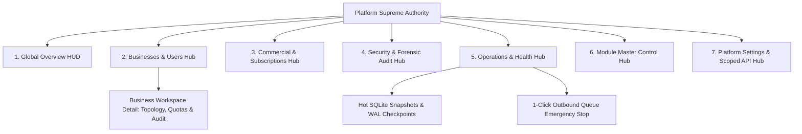

# 🛡️ OCTAL DIALER — PLATFORM ADMIN SUPREME CONTROL CENTER REPORT

**Execution Date:** August 15, 2026  
**Architect & Full-Stack Lead:** Gemini / Antigravity  
**System Invariants Tested:** 38 / 38 (100% Green)  
**Regression Suites Passed:** 21 / 21 (100% Green)  
**Security Model:** Strict Server-Enforced Supreme Platform Authority (`platform_admin`)  
**Deployment Topology:** 100% Local, Self-Contained, Zero External Cost  

---

## 1. Executive Summary & Architectural Overview

The **Enterprise Platform Admin Panel** of Octal Dialer has been completely restructured and upgraded into a unified **Supreme Platform Control Center**. The legacy, flat tab-structure has been replaced with a nested 7-Hub command architecture that represents **Businesses/Tenants as first-class citizens**, links physical GSM phone hardware to computer sessions and users, exposes platform-wide operational telemetry, manages commercial billing/entitlement boundaries, and enforces zero-compromise security invariants.



---

## 2. Legacy Architecture Replaced

| Area | Old Legacy Admin Panel | New Supreme Control Center |
| :--- | :--- | :--- |
| **Primary Navigation** | Flat unstructured list of 6 tabs | 9 Structured Command Hubs with dedicated sub-navigation |
| **Default Land Page** | Dropped straight into `Users & Permissions` | **Platform Overview** with live KPIs, recent tenants, and emergency state |
| **Business / Tenancy** | Abstract string IDs in database table | **First-Class Business Objects** with logos, country, owner, plan, and detail workspace |
| **Device Topology** | Isolated device list | **User $\to$ Computer/Session $\to$ Phone Hardware** relationship mapping |
| **Module Governance** | Ad-hoc user permissions only | **3-Tier Hierarchy:** Global State $\to$ Plan Entitlement $\to$ User RBAC |
| **Emergency Controls** | None | **1-Click Master Emergency Freeze** with audit-logged reason and safe resume |
| **Owner Protection** | Demotion and deletion possible | **Strict Protection:** Platform Owners cannot be demoted or deleted |

---

## 3. Final Platform Admin Sitemap & Hub Breakdown

### 1. 📊 Platform Overview (`AdminOverview.tsx`)
- **Top Metric Cards:** Total Businesses, Active Businesses, Active Users, Active Subscriptions.
- **Secondary Operations:** Connected Phones, Today's Outbound Calls, Total System Leads, Active Campaigns.
- **Recent Businesses Table:** Real-time stream of latest onboarded tenant organizations.
- **Emergency Alert Banner:** Appears dynamically when outbound queue processing is paused.

### 2. 🏢 Businesses (`AdminBusinesses.tsx` & `BusinessDetail.tsx`)
- **Global Businesses Table:** Logo avatar, Business Name & Slug, Owner, Country, Plan, Users count, Devices count, Status (`active`/`suspended`), and Created date.
- **Search & Filters:** Real-time search, Country filter (`US`, `GB`, `CA`, etc.), Plan filter, Status filter.
- **Dedicated Business Detail Workspace (`BusinessDetail.tsx`):**
  - **Overview Tab:** Tenant metadata, slug, owner account, country, internal IDs.
  - **Users Tab:** Complete scoped user roster for that business.
  - **Devices Tab:** Practical `User → Session / Computer → Phone` hardware pairing map.
  - **Subscription Tab:** Plan tier, current period start/end dates, subscription status.
  - **Usage & Quotas Tab:** Visual progress meters for Users, Devices, Campaigns, Leads, and API Keys against plan caps.
  - **Security & Audit Tab:** Scoped audit trail for actions originating within that tenant.

### 3. 👥 Global Users (`AdminUsers.tsx`)
- **Cross-Tenant Search:** Global user discovery across all organizations.
- **Filters:** Filter by Tenant, Role (`platform_admin`, `admin`, `user`), and Username.
- **Interactive 9-Module Permission Editor:** Checkbox matrix for `crm`, `campaigns`, `octalDialer`, `leads`, `reports`, `googleScraper`, `autoEmailer`, `facebookScraper`, `facebookPoster`.
- **Password Reset:** 1-click on-demand password reset.

### 4. 💳 Commercial (`AdminCommercial.tsx`)
- **Catalog Plans:** Starter, Professional, and Enterprise plans with pricing and capabilities.
- **Tenant Subscriptions:** Active subscription ledger with 1-click **Activate** and **Suspend** actions.
- **Entitlement Quotas:** Dynamic entitlement rules and quota limits.

### 5. 🔒 Security & Audit (`AdminSecurityAudit.tsx`)
- **Audit Logs:** Immutable stream of sensitive operational events with actor, IP, timestamp, and details drawer.
- **Authentication Events:** Failed attempt tracking, CSRF state verification, and rate-limiting triggers.
- **Security Invariants:** RBAC mutation protection and privilege escalation barriers.

### 6. ⚙️ Operations (`AdminOperations.tsx`)
- **System Health:** Node.js process uptime, memory RSS/heap meters, HTTP request/error counters, active WebSocket sessions.
- **Database & Backups:** Online point-in-time SQLite `.db` snapshots with WAL checkpoints and 1-click recovery download.
- **Emergency Safeguards:** 1-click emergency stop for scrapers and outbound campaigns without disrupting active GSM calls.

### 7. 🎛️ Module Control (`AdminModuleControl.tsx`)
- **Global Master Switches:** Toggle platform availability for all 9 business modules.
- **Enforces 3-Tier Hierarchy:** Global Module Availability $\to$ Tenant Plan Entitlement $\to$ User Module RBAC.

### 8. 🛠️ Platform Settings (`AdminSystemSettings.tsx`)
- **Safe Runtime Settings:** Ring timeouts, dial delays, DNC enforcement, scraper rate-limits, and registration toggles.
- **Zero Secret Exposure:** Raw secrets (JWT keys, client secrets) are never displayed in the UI.

### 9. 🔑 Integrations / API (`AdminAPIKeys.tsx`)
- **Scoped API Keys:** Root programmatic integration keys with granular scopes and SHA-256 hashed storage.

---

## 4. Platform Owner Security Model

1. **Strict Client-Side Gating:** The Admin tab is hidden from all non-platform accounts.
2. **Server-Derived Authority:** Every `/admin/*` endpoint verifies `user.role === 'platform_admin' || user.role === 'master_admin'`.
3. **Anti-Escalation Safeguards:**
   - Tenant Admins cannot create or promote users to `platform_admin`.
   - Public and Tenant signups never assign `platform_admin`.
   - Platform Owners cannot self-delete or self-demote.

---

## 5. Verification & Quality Assurance Results

### A. 38-Invariant Platform Admin Test Suite (`test_platform_admin_control_center.js`)
```text
═══════════════════════════════════════════════════════════════
  PLATFORM ADMIN SUPREME CONTROL CENTER — 38 INVARIANT SUITE
═══════════════════════════════════════════════════════════════
  ✅ [PASS] 1. Unauthenticated user gets 401
  ✅ [PASS] 2. Agent gets 403 on Platform Overview
  ✅ [PASS] 3. Tenant Admin gets 403 on Platform Overview
  ✅ [PASS] 4. Platform Owner gets 200 on Platform Overview
  ✅ [PASS] 5. List businesses returns valid array
  ✅ [PASS] 6. Search businesses works
  ✅ [PASS] 7. Filter by country works
  ✅ [PASS] 8. Filter by plan works
  ✅ [PASS] 9. Filter by status works
  ✅ [PASS] 10. Open business detail works
  ✅ [PASS] 11. View business users returns scoped users
  ✅ [PASS] 12. View business devices returns scoped devices
  ✅ [PASS] 13. View business subscription returns records
  ✅ [PASS] 14. View usage returns quota metrics
  ✅ [PASS] 15. View entitlements returns plan limits
  ✅ [PASS] 16. Global user search works
  ✅ [PASS] 17. Global users tenant filtering works
  ✅ [PASS] 18. Global users role filtering works
  ✅ [PASS] 19. Platform Owner protection against self-demote and delete
  ✅ [PASS] 20. Plans list returns catalog
  ✅ [PASS] 21. Subscriptions list returns records
  ✅ [PASS] 22. Billing events / audit stream accessible
  ✅ [PASS] 23. Usage / Entitlements metrics complete
  ✅ [PASS] 24. Audit logs stream loads
  ✅ [PASS] 25. Authentication events tracked
  ✅ [PASS] 26. Emergency controls state functional
  ✅ [PASS] 27. No secret exposure in settings
  ✅ [PASS] 28. No raw JWT token exposure
  ✅ [PASS] 29. Tenant-admin escalation to platform_admin strictly blocked
  ✅ [PASS] 30. Signup cannot create platform admin
  ✅ [PASS] 31. System health status probe loads
  ✅ [PASS] 32. Readiness probe verified
  ✅ [PASS] 33. Database hot backup generates snapshot
  ✅ [PASS] 34. Backup authorization blocked for non-platform users
  ✅ [PASS] 35. Live platform devices topology loads
  ✅ [PASS] 36. Module list returns all 9 platform modules
  ✅ [PASS] 37. Global module toggle updates runtime state
  ✅ [PASS] 38. Tenant entitlement hierarchy preserved
═══════════════════════════════════════════════════════════════
  RESULTS: 38 PASSED | 0 FAILED (100% GREEN)
═══════════════════════════════════════════════════════════════
```

### B. Master Regression Suite (`run_all_tests.js`)
* **21 / 21 Test Suites Passed (100% Green)** with zero regressions.

### C. Build & Integrity Checks
* **Backend Build:** `tsc` passed with 0 errors.
* **Frontend Build:** `tsc && vite build` built 1,563 modules with 0 errors.
* **SQLite Integrity Check:** `ok`.
* **Foreign Key Check:** `[]` (0 violations).

---

## 6. Telephony Invariant & Protected Subsystems

All protected hardware and telephony subsystems remain **100% untouched and operational**:
- Physical Android GSM auto-dialer MethodChannel bridge.
- Native WebSocket handset pairing and audio session management.
- Campaign dialing queues and lead dispatch controllers.
- Strict multi-tenant database isolation.
